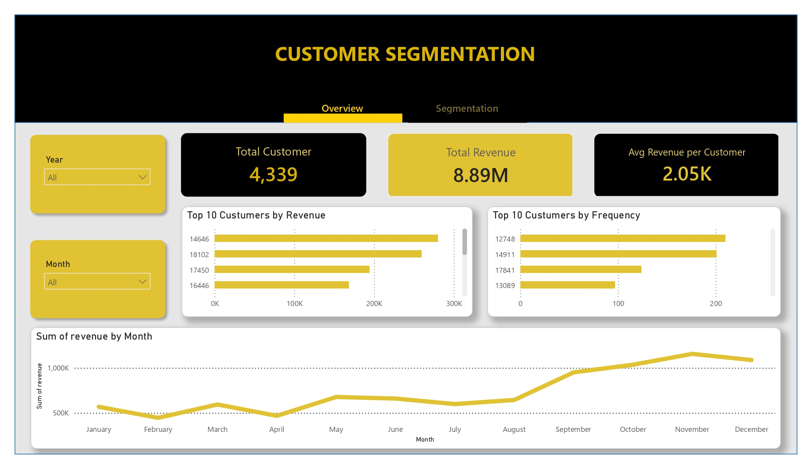
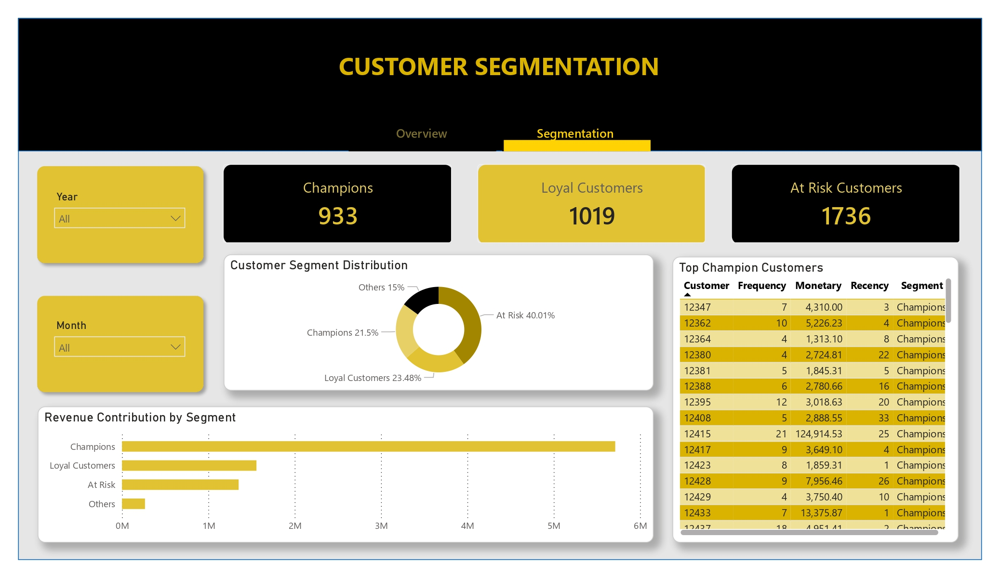
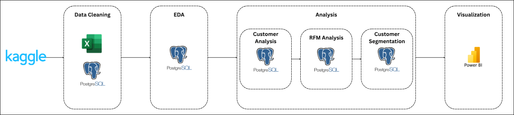

# Customer Segmentation Analysis
## Project Overview
This project analyzes customer purchasing behavior using RFM (Recency, Frequency, Monetary) analysis to identify valuable customers, customer segments, and revenue contribution across segments.

The analysis helps businesses understand customer value, improve retention strategies, and target marketing efforts more effectively.


## Business Questions
1. Who are our most valuable customers?
2. Which customers purchase most frequently?
3. Which customers generate the highest revenue?
4. Which customers have not purchased recently?
5. How can customers be grouped based on purchasing behavior?
6. Which customer segments contribute the most revenue?

## Main Analysis

### Customer Analysis
- Identified customers with the highest revenue contribution.
- Identified customers with the highest purchase frequency.
- Analyzed customer recency to detect inactive customers.

### RFM Analysis
- Calculated Recency, Frequency, and Monetary metrics for each customer.
- Evaluated customer purchasing behavior using RFM methodology.

### Customer Segmentation
- Segmented customers into Champions, Loyal Customers, At Risk, and Others.
- Measured customer distribution across segments.
- Analyzed revenue contribution by customer segment.

## Dataset
- Sourec: E-Commerce Data (Kaggle)

## Tools

## Dashboard Preview

### Customer Overview


### Customer Segments


## Key Insights
- Champions represent the most valuable customer group based on purchasing behavior.
- Revenue is concentrated among a relatively small group of high-value customers.
- Loyal customers consistently contribute to business revenue through repeat purchases.
- At Risk customers represent potential churn and may require retention initiatives.
- Customer segmentation provides actionable insights for targeted marketing strategies.

## Workflow


## Skills Demonstrated
- SQL
- Data Cleaning & Validation
- Exploratory Data Analysis (EDA)
- Customer Analytics
- RFM Analysis
- Customer Segmentation
- Power BI Dashboard Development
- Data Visualization
- Business Intelligence Reporting

## Repository Structure
```text
CustomerSegmentationAnalysis/
│
├── Dashboard/
│   └── customer_segment.pbix
│ 
├── Data/
│   ├── raw/
│   └── clean/
│
├── Image/
│   ├── customer_overview.jpg
│   └── customer_segments.jpg
│
├── SQL/
│   ├── 01_create_table.sql
│   ├── 02_eda.sql
│   ├── 03_customer_analysis.sql
│   ├── 04_rfm_analysis.sql
│   └── 05_customer_segmentation.sql
│
└── README.md